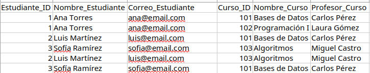
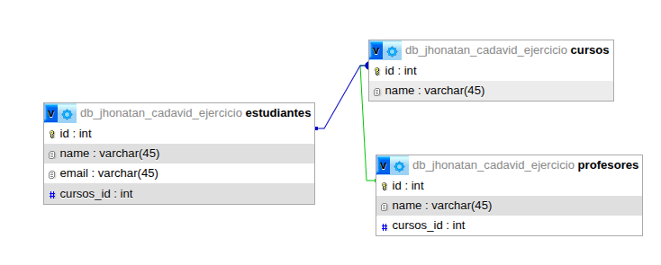

# Ejercicio 1: Gestion Academica

Sistema de gestion academica

## 1. Estado Inicial (Datos Desnormalizados)
Aquí se muestra la estructura original antes de aplicar las reglas de normalización. Una "hoja de cálculo" plana con redundancia de datos.

---

## 2. Proceso de Normalización
A continuación, se detalla la transición hacia un modelo relacional.

### Diseño Relacional (DER)
Tras aplicar las formas normales (1FN, 2FN y 3FN), el diseño final quedó estructurado de la siguiente manera:

