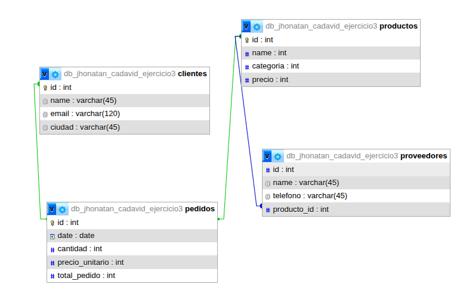

# Ejercicio 1: Gestion Academica

Breve descripción del caso de uso (Ej: Sistema de facturación para una ferretería).

## 1. Estado Inicial (Datos Desnormalizados)
Aquí se muestra la estructura original antes de aplicar las reglas de normalización. Generalmente, una "hoja de cálculo" plana con redundancia de datos.


---

## 2. Proceso de Normalización
A continuación, se detalla la transición hacia un modelo relacional.

### Diseño Relacional (DER)
Tras aplicar las formas normales (1FN, 2FN y 3FN), el diseño final quedó estructurado de la siguiente manera:



:::info Cambios Clave
- Se separaron los datos de **X** en una tabla independiente para evitar redundancia.
:::

---

## 3. Implementación en SQL


```sql
-- Coloca aquí tus CREATE TABLE
-- No olvides las Primary Keys y Foreign Keys

CREATE TABLE Ejemplo (
    id INT PRIMARY KEY,
    nombre VARCHAR(100)
);

-- Continúa con el resto de tus tablas...
