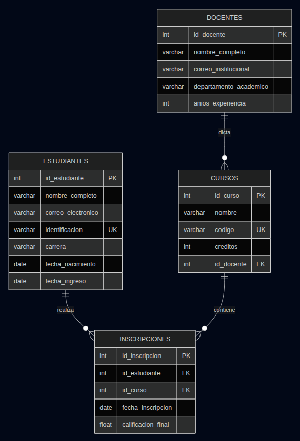
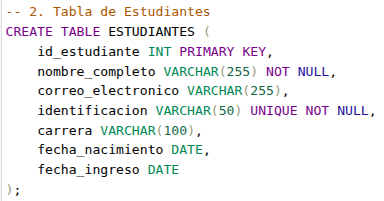
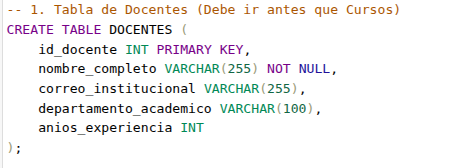
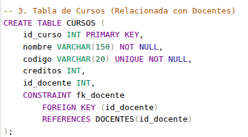
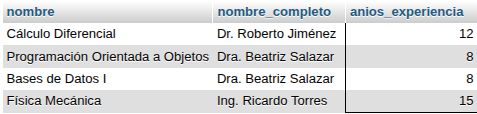
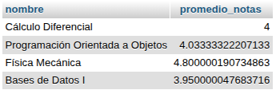

# Semana 2: Análisis de Datos
En esta sección documentamos los pasos para resolver el ejercicio de la semana 2.

# Proyecto: Sistema de Gestión Académica

Esta documentación detalla el diseño y la implementación de la base de datos `gestion_academica_universidad` realizada en MySQL.

##  Task 1: Diseño de la Base de Datos

Se ha diseñado un esquema relacional que incluye validaciones de integridad (`NOT NULL`, `UNIQUE`, `CHECK`).




## Tablas Principales
### Estudiantes: Datos personales y carrera.

### Docentes: Información académica y experiencia.

### Cursos: Relacionados con un docente responsable.

### Inscripciones: Tabla de unión que registra calificaciones y fechas.


##  Task 2: Insercion de datos


### 5 Estudiantes

```sql
INSERT INTO ESTUDIANTES (
    id_estudiante, 
    nombre_completo, 
    correo_electronico, 
    identificacion, 
    carrera, 
    fecha_nacimiento, 
    fecha_ingreso
)
VALUES 
    (1, 'Carlos Andrés Ruiz', 'carlos.ruiz@email.com', 'ID-102030', 'Ingeniería Civil', '2002-05-15', '2024-02-01'),
    (2, 'Laura Sofía Méndez', 'laura.mendez@email.com', 'ID-405060', 'Administración', '2001-11-20', '2024-02-01'),
    (3, 'Mateo Villalba', 'mateo.v@email.com', 'ID-708090', 'Psicología', '2003-01-10', '2024-02-05'),
    (4, 'Valentina Ospina', 'val.ospina@email.com', 'ID-112233', 'Medicina', '2000-08-25', '2023-07-15'),
    (5, 'Julián Castro', 'j.castro@email.com', 'ID-445566', 'Sistemas', '2002-03-30', '2024-01-20');
```

### 3 Docentes 
 ```sql
INSERT INTO DOCENTES (
    id_docente, 
    nombre_completo, 
    correo_institucional, 
    departamento_academico, 
    anios_experiencia
)
VALUES 
    (1, 'Dr. Roberto Jiménez', 'r.jimenez@universidad.edu', 'Matemáticas', 12),
    (2, 'Dra. Beatriz Salazar', 'b.salazar@universidad.edu', 'Ciencias Computacionales', 8),
    (3, 'Ing. Ricardo Torres', 'r.torres@universidad.edu', 'Física', 15);
 ```

### 4 Cursos 

 ```sql
 INSERT INTO CURSOS (
    id_curso, 
    nombre, 
    codigo, 
    creditos, 
    id_docente
)
VALUES 
    (101, 'Cálculo Diferencial', 'MAT-101', 4, 1),
    (102, 'Programación Orientada a Objetos', 'COMP-202', 3, 2),
    (103, 'Física Mecánica', 'FIS-301', 4, 3),
    (104, 'Bases de Datos I', 'COMP-205', 3, 2);
  ```

### 8 Inscripciones 

 ```sql
INSERT INTO INSCRIPCIONES (
    id_inscripcion, 
    id_estudiante, 
    id_curso, 
    calificacion_final
)
VALUES 
    (1, 1, 101, 4.5), -- Carlos en Cálculo
    (2, 1, 102, 3.8), -- Carlos en Programación
    (3, 2, 102, 4.2), -- Laura en Programación
    (4, 2, 104, 4.0), -- Laura en Bases de Datos
    (5, 3, 101, 3.5), -- Mateo en Cálculo
    (6, 4, 103, 4.8), -- Valentina en Física
    (7, 5, 104, 3.9), -- Julián en Bases de Datos
    (8, 5, 102, 4.1); -- Julián en Programación
  ```

##  Task 3: Consultas básicas y manipulación

### 1. Listar estudiantes con sus inscripciones y cursos (JOIN)

 ```sql
SELECT E.nombre_completo, C.nombre AS curso, I.fecha_inscripcion
FROM ESTUDIANTES E
JOIN INSCRIPCIONES I ON E.id_estudiante = I.id_estudiante
JOIN CURSOS C ON I.id_curso = C.id_curso;
  ```


### 2. Cursos dictados por docentes con > 5 años de experiencia

 ```sql
SELECT C.nombre, D.nombre_completo, D.anios_experiencia
FROM CURSOS C
JOIN DOCENTES D ON C.id_docente = D.id_docente
WHERE D.anios_experiencia > 5;
  ```




### 3. Promedio de calificaciones por curso (GROUP BY + AVG)

 ```sql
SELECT C.nombre, AVG(I.calificacion_final) AS promedio_notas
FROM CURSOS C
JOIN INSCRIPCIONES I ON C.id_curso = I.id_curso
GROUP BY C.nombre;
  ```



### 4. Estudiantes inscritos en más de un curso (HAVING COUNT)

 ```sql
SELECT E.nombre_completo, COUNT(I.id_curso) AS total_cursos
FROM ESTUDIANTES E
JOIN INSCRIPCIONES I ON E.id_estudiante = I.id_estudiante
GROUP BY E.nombre_completo
HAVING COUNT(I.id_curso) > 1;
  ```


### 5. Cursos con más de 2 estudiantes inscritos

 ```sql
SELECT C.nombre, COUNT(I.id_estudiante) AS numero_estudiantes
FROM CURSOS C
JOIN INSCRIPCIONES I ON C.id_curso = I.id_curso
GROUP BY C.nombre
HAVING COUNT(I.id_estudiante) > 2;
  ```


### 6. Modificación de Estructura (ALTER & DELETE)

 ```sql
ALTER TABLE ESTUDIANTES 
ADD COLUMN estado_academico VARCHAR(20) DEFAULT 'Activo';
  ```


##  Task 4: Subconsultas y funciones

### 1. Estudiantes con promedio superior al promedio general

 ```sql
SELECT E.nombre_completo, AVG(I.calificacion_final) AS promedio_personal
FROM ESTUDIANTES E
JOIN INSCRIPCIONES I ON E.id_estudiante = I.id_estudiante
GROUP BY E.id_estudiante, E.nombre_completo
HAVING AVG(I.calificacion_final) > (
    SELECT AVG(calificacion_final) 
    FROM INSCRIPCIONES
);
  ```


### 2. Carreras con estudiantes en cursos específicos (Uso de IN)

 ```sql
SELECT DISTINCT carrera 
FROM ESTUDIANTES 
WHERE id_estudiante IN (
    SELECT id_estudiante 
    FROM INSCRIPCIONES 
    WHERE id_curso IN (SELECT id_curso FROM CURSOS WHERE creditos >= 4)
);
  ```


### 3. Funciones de Agregación e Indicadores

 ```sql
SELECT 
    COUNT(*) AS total_inscripciones,
    ROUND(AVG(calificacion_final), 2) AS promedio_general,
    MAX(calificacion_final) AS nota_mas_alta,
    MIN(calificacion_final) AS nota_mas_baja,
    SUM(C.creditos) AS total_creditos_dictados
FROM INSCRIPCIONES I
JOIN CURSOS C ON I.id_curso = C.id_curso;
  ```


##  Task 5: Creación de una vista

 ```sql
CREATE VIEW vista_historial_academico AS
SELECT 
    E.nombre_completo AS estudiante,
    C.nombre AS curso,
    D.nombre_completo AS docente,
    I.fecha_inscripcion AS fecha, -- Usamos la fecha como referencia de semestre
    I.calificacion_final AS nota
FROM INSCRIPCIONES I
JOIN ESTUDIANTES E ON I.id_estudiante = E.id_estudiante
JOIN CURSOS C ON I.id_curso = C.id_curso
JOIN DOCENTES D ON C.id_docente = D.id_docente;
  ```


##  Task 6: Control de acceso y transacciones


### 1. Otorgar permisos de lectura

 ```sql
CREATE ROLE revisor_academico;
GRANT SELECT ON vista_historial_academico TO revisor_academico;
  ```


## Transacciones
Control de flujo mediante BEGIN, SAVEPOINT y ROLLBACK para asegurar la consistencia de las notas.